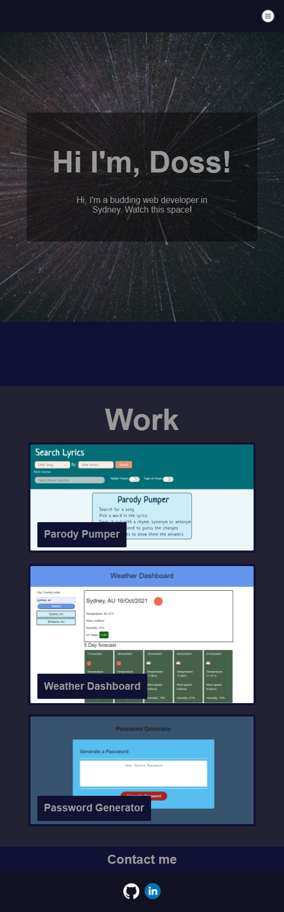
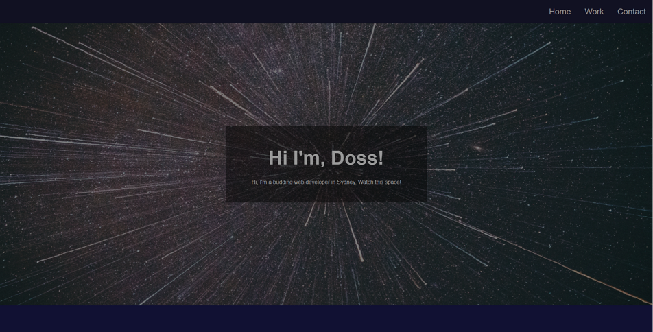
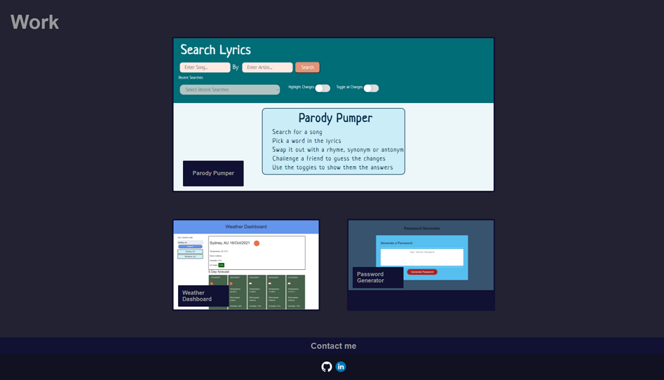

# Portfolio

This is my portfolio that is developed from the mock portfolio. It is mobile friedly with a dropdown nav menu.
I currently have 3 deployed projects listed that when clicked will take you to the corrosponding site.

Github and linkedIn links are now icons that will take you to my profile pages.

I've tried adding a hero to add asthetic appeal but am yet to make it responsive to any screen size so it fills 100%.

Link to [deployed site](https://gitme-waffles.github.io/portfolio/)
- - -
## Mobile Friendly

- - -
## Desktop

